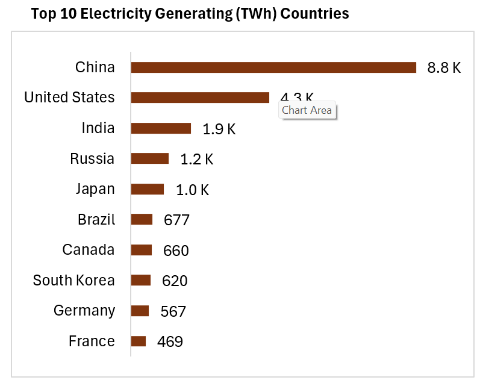

# Global Trends in Electricity Access: Progress and Challenges (2000–2022)

## Overview
This project explores global trends in electricity access from 2000 to 2022, analyzing regional disparities, key influencing factors, and the relationship between electricity availability and socio-economic development. The analysis utilizes SQL (Microsoft SSMS precisely) to pre-process and analyze datasets while using Microsoft Excel to visualize findings, providing insights into electricity generation, energy consumption, and economic indicators.

## Project Details
- **Author**: Chinedu Uzorue
- **Project Type**: SQL Capstone Project
- **Date**: February 2025

## Dataset Overview
The project uses six primary tables and one supplementary table:

### Primary Tables:
1. **elec-fossil-nuclear-renewables**: Electricity generation data from renewables, nuclear, and fossil fuels.
2. **change-energy-consumption**: Annual changes in primary energy consumption.
3. **electricity-generation**: Total electricity generation across entities.
4. **primary-energy-cons**: Primary energy consumption in terawatt-hours (TWh).
5. **share-of-the-population-with-access-to-electricity**: Percentage of the population with electricity access.
6. **GDP-Per-Capita-usd**: GDP per capita data across different countries and years.

### Supplementary Table:
- **country_codes_and_continents**: Maps country names to their respective codes and continents.

## Research Questions
The primary objective of this analysis was to explore the relationships between energy consumption, electricity generation, socio-economic factors, and access to electricity. The research was guided by the following key questions:
1. What is the trend of electricity generation per continent from 2000 to 2022?
2. How does electricity access correlate with electricity generation from different sources?
3. How has electricity generation from renewables, nuclear, and fossil fuels evolved over time?
4. Which countries had the highest electricity generation in 2022?
5. What is the relationship between GDP per capita and electricity generation/population access?
6. How has the annual change in primary energy consumption influenced electricity generation?

## Methodology
- **Data Cleaning**: Handling missing values, removing duplicates, and standardizing data types.
- **Data Transformation**: Converting wide-format GDP data into long format using dynamic SQL.
- **Data Merging**: Joining multiple tables for a comprehensive dataset.
- **Exploratory Data Analysis (EDA)**: Understanding trends and relationships in the data.
- **SQL Queries**: Extracting insights using structured queries.
- **Visualization**: Graphical representation of trends using Microsoft Excel.

## Key Findings
### Electricity Generation Trends

- **Electricity Generation Growth**: All continents experienced an increase in electricity generation, with Asia leading due to rapid industrialization in China and India.
- **Electricity Access & Generation**: Countries with higher access to electricity tend to rely more on renewables.

- **Fossil Fuel Dominance**: Despite growth in renewables, fossil fuels remain the dominant source of electricity.
Over the years, there was a gradual increase in the share of electricity generated from renewable sources, with fossil fuels remaining dominant in many countries. Nuclear generation, however, showed little overall growth.

### Top Electricity Generators (2022)

- **Top 10 Electricity Generators (2022)**: China, the US, India, Russia, and Japan.

### GDP Per Capita and Electricity Access

- **GDP and Electricity Access**: A positive correlation exists between higher GDP per capita and increased electricity access from renewables.
Higher GDP per capita was found to be positively correlated with higher access to electricity, especially from renewables, indicating that wealthier nations are investing more in clean energy technologies.

## Recommendations
Based on the findings from the analysis, the following are recommendations:
1. **Sustainable Energy Policies**: Countries need to encourage a transition to renewables.
2. **Infrastructure Development**: Governments should aim to improve electricity access in underserved regions, especially in Sub-Saharan Africa.
3. **Energy Efficiency Initiatives**: Promote policies to balance demand with environmental concerns.
4. **Economic Growth Strategies**: Strengthen economies to enhance electricity production and access.

## Challenges & Solutions
I encountered a couple of challenges in the analysis including:
- **Missing Data**: Filled missing values with appropriate defaults.
- **Data Format Issues**: Used dynamic SQL for data transformation.
- **Duplicate Data**: Identified and removed duplicates using primary keys.
- **Complex Joins**: Preprocessed data to ensure seamless merging.

## Data Sources
- [World Bank](https://data.worldbank.org/indicator/NY.GDP.PCAP.CD)
- [Our World in Data - Energy](https://ourworldindata.org/energy-production-consumption)
- [Our World in Data - Electricity Access](https://ourworldindata.org/energy-access)
- [Our World in Data - Energy Problems](https://ourworldindata.org/worlds-energy-problem)

## Future Work
- Expanding the analysis to include recent years.
- Deepening insights into renewable energy transitions.
- Developing interactive dashboards for real-time analysis.

For any inquiries or contributions, feel free to submit an issue or pull request.

